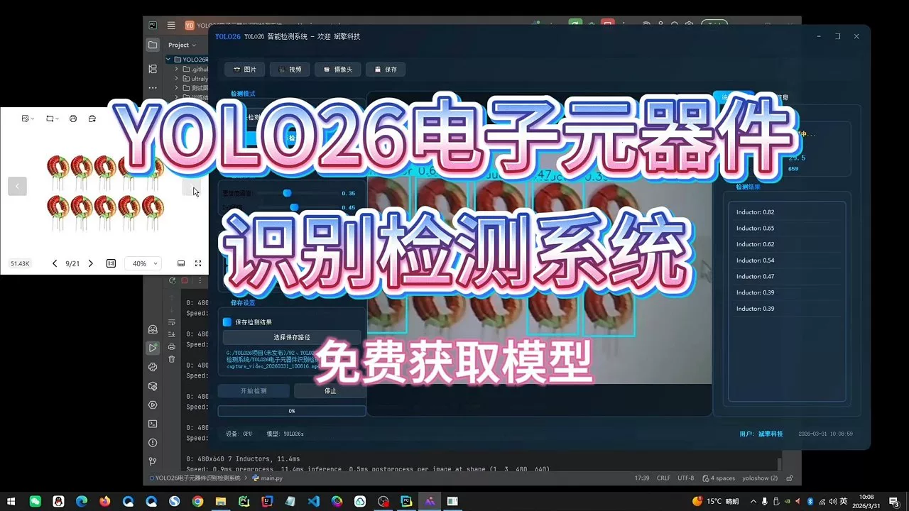
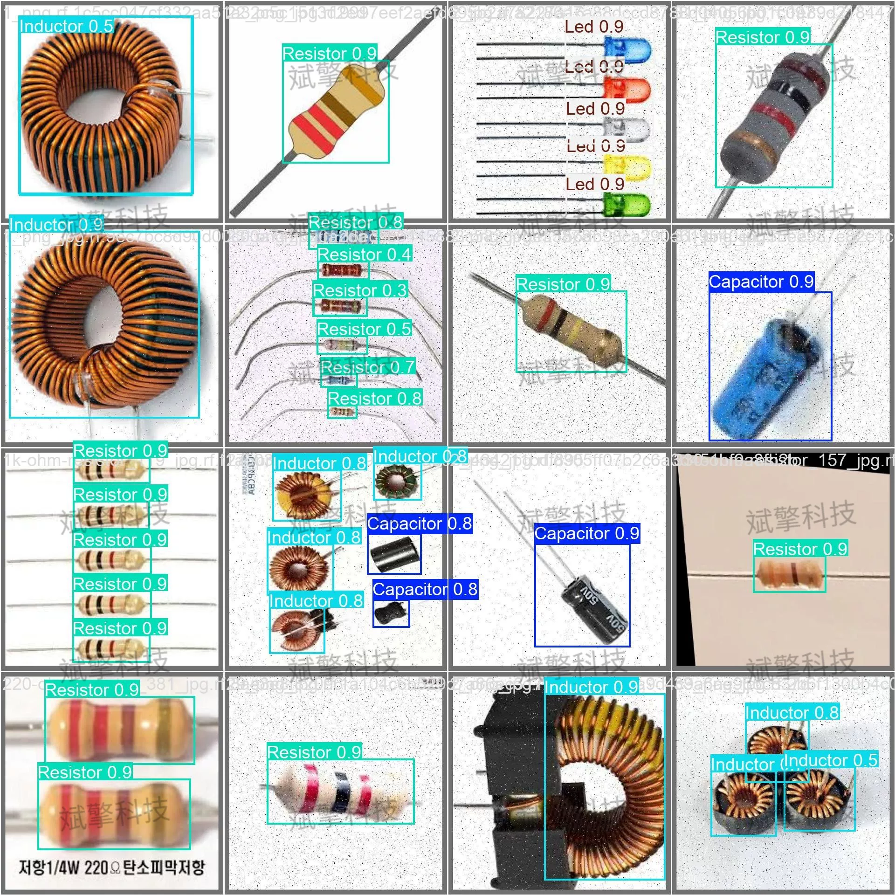
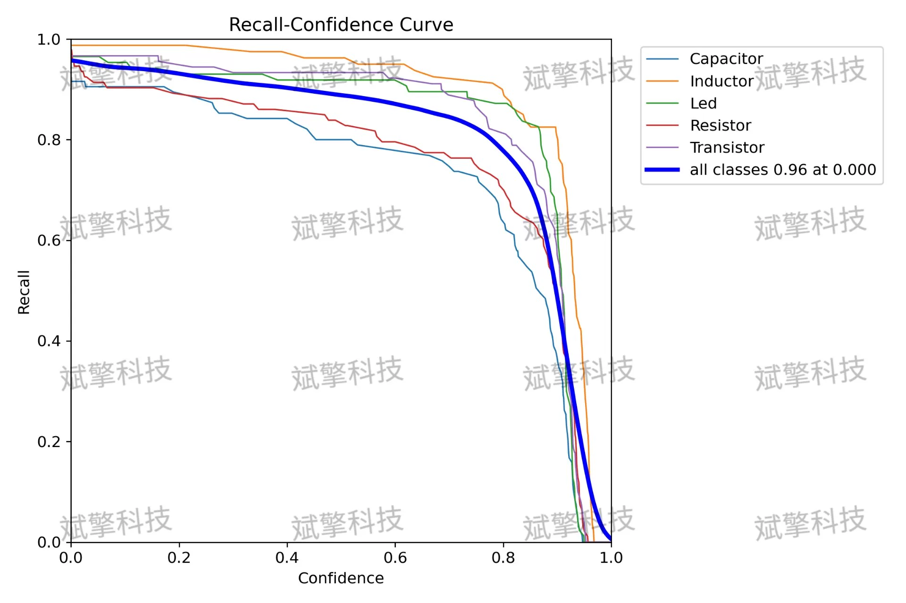
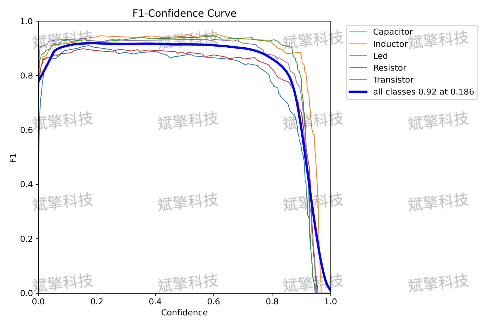
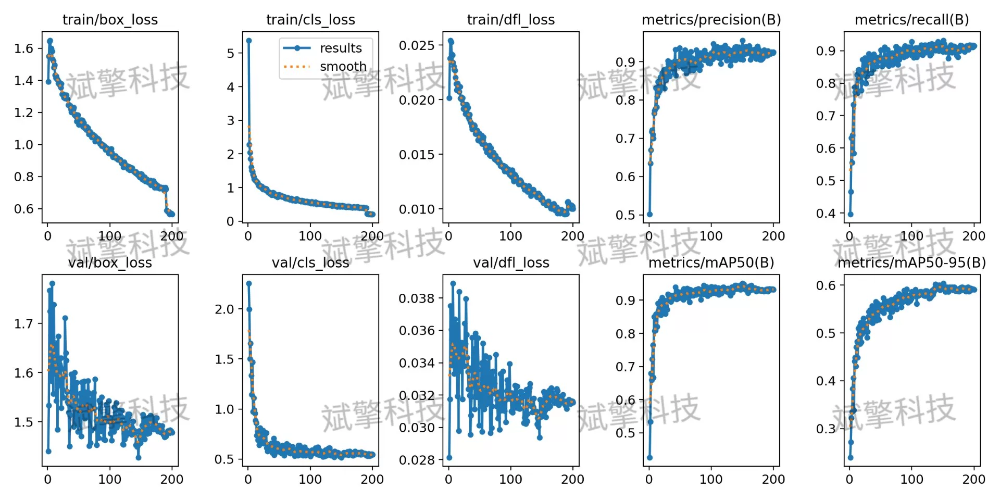
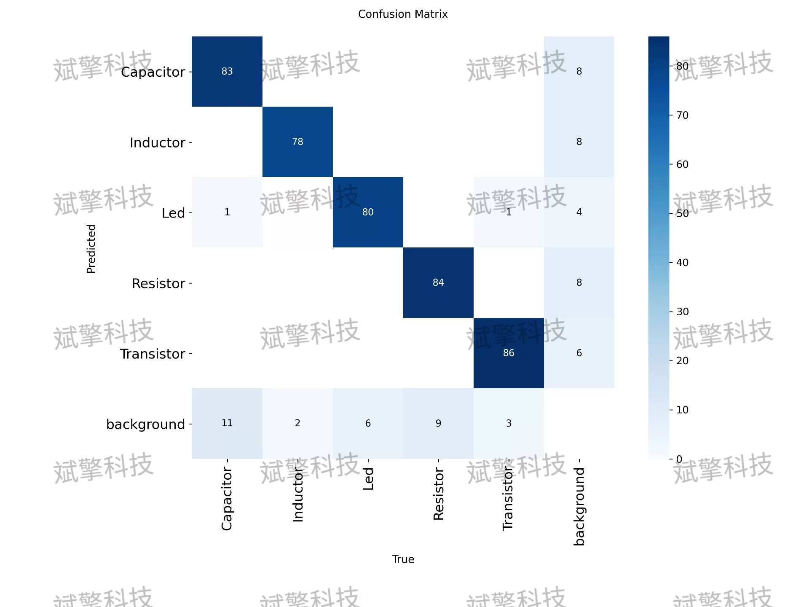
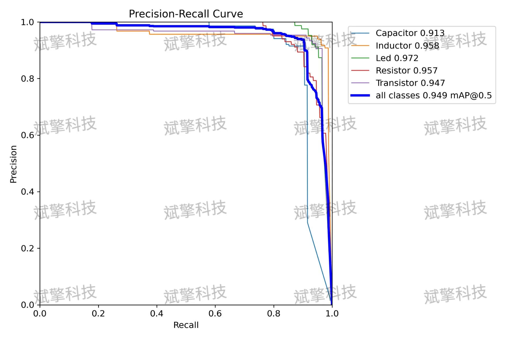
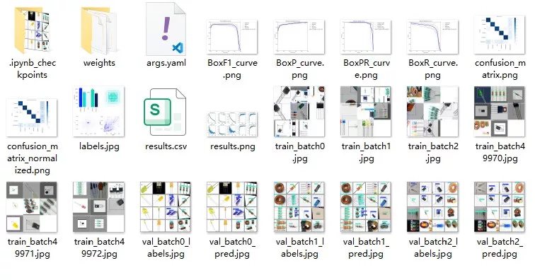
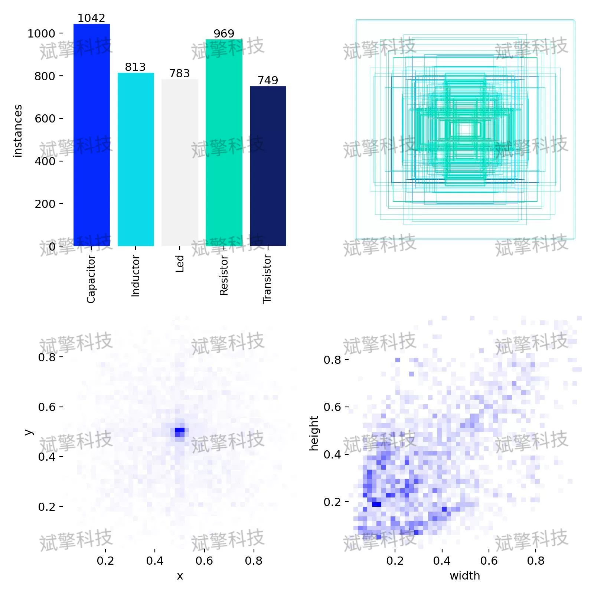

# YOLOv26 Electronic Part Recognition and Detection System | Model

## Body

YOLO26 Electronic Parts Recognition and Detection System | Model [YOLO26 Electronic Parts Detection] mAP up to 94.9%! One-click recognition of five types of electronic components (capacitor/inductor/LED/resistor/transistor)

This article designs and implements an electronic parts recognition and detection system based on the YOLO26 framework, aiming to automate the recognition of five common electronic components in circuit boards: Capacitor (Capacitor), Inductor (Inductor), LED (Light Emitting Diode), Resistor (Resistor), and Transistor (Transistor). The system uses the YOLO object detection algorithm, trained on a dataset containing 2103 training images, and evaluated on a validation set of 226 images and a test set of 97 images. The experimental results show that the model achieves an average precision mean (mAP@0.5) of 0.949 on the validation set, with the LED category performing best (AP=0.972), while the Capacitor category is relatively lower but still reaches 0.913. The training loss function converges smoothly without significant overfitting. By analyzing the precision-recall curve and confusion matrix, the model demonstrates good detection accuracy and class discrimination capabilities, meeting the practical needs of automatic recognition and positioning of electronic components.

The dataset contains five common electronic components: Capacitor (Capacitor), Inductor (Inductor), LED (Light Emitting Diode), Resistor (Resistor), and Transistor (Transistor).
Training set: 2103 images
Validation set: 226 images
Test set: 97 images

Free reservation for remote installation. Unsuccessful installation will result in a full refund.
Purchase includes the following resources (accessible through Baidu Cloud):
- Complete source code for YOLO recognition detection project
- YOLO format datasets
- Training code + UI interface code
- Trained model + results images
- Software installer package
- Add WeChat to make a reservation for remote installation (automatically display WeChat ID after purchase) - Unsuccessful, full refund guaranteed

⚙️ Core functionality modules
Detection capability
- Image detection: upload and detect, return detection boxes + category information
- Video detection: supports video files, analyzes frames accurately
- Camera real-time detection: connects to USB camera for dynamic monitoring
Interaction and control
- Target selection: freely choose one or more categories for detection
- Parameter adjustment: adjustable confidence threshold & IoU threshold, flexible control of accuracy
- Results saving: save images/videos/camera detection results in one click
System and data
- User login registration: supports password strength checking + encryption storage
- Log recording: automatically records operation and error information (timestamped)

## Images

## Payment

Here is a pay link on Stripe ( https://buy.stripe.com/3cs8yP7sY87d0vu9AB ). Please contact me lonlonago@foxmail.com after funding $89, and I will send you a complete data files , thank you!

